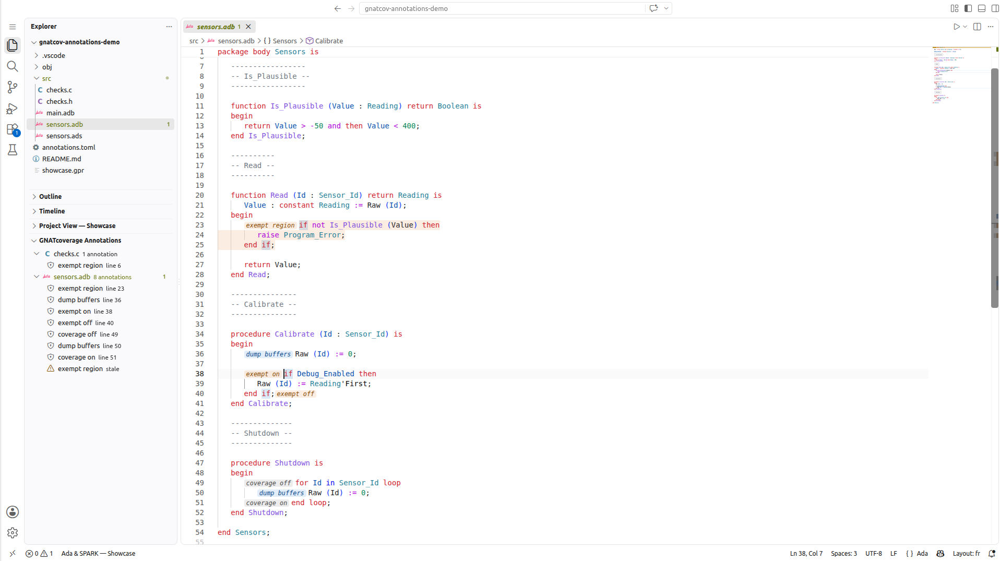
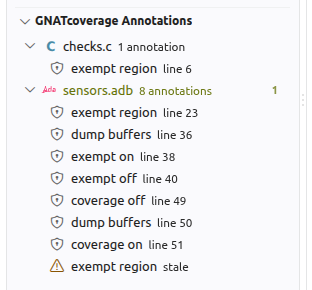

.. _ext_annot:

###########################
External source annotations
###########################

In case modifying the sources is not possible or desirable, it is possible to
generate annotations in separate files, which can be passed to |gcvins| or
|gcvcov| to modify the behavior of the instrumenter or of the coverage
analysis.

Annotations loaded from an external file can be used along in-source
annotations, however in case of conflicts, the annotations defined in the
sources will always be prioritized.

External annotations are stored in TOML files, which can be manipulated through
four |gcv| commands, |gcvaddan|, |gcvdelan|, |gcvshoan| and |gcvxtran|, to
respectively add a new annotations, delete an existing annotation from the
files, show the annotations that are stored in the files, or turn the in-source
annotations of a set of sources into external ones.

Once generated, annotation files should be passed to the |gcvins| or |gcvcov|
commands with the :cmd-option:`--external-annotations` switch for them to be
taken into account by |gcv|.

.. _ext_annot_attribute:

Designating the annotation file from the project
################################################

A project can designate its annotation file once, instead of repeating
:cmd-option:`--external-annotations` on every command::

    package Coverage is
       for External_Annotations use "annotations.toml";
    end Coverage;

The name is interpreted from the directory of the project defining the
attribute, and may be a path rather than a base name.

Each project designates at most one file, but every project in the tree may
designate its own. Which ones a command uses depends on what it does with them:

* |gcvcov|, |gcvins| and |gcvshoan| **read** annotations, and load every file
  the project tree designates: a project's annotations describe its own units,
  and matter to whoever depends on it.

* |gcvaddan| **writes** an annotation, and writes it to the file designated by
  the project that owns the annotated unit -- not to the root project's. An
  annotation belongs with the unit it applies to. If that project designates no
  file, |gcv| says so and stops rather than choosing one.

* |gcvdelan| rewrites the file the deleted annotation was loaded from, leaving
  the other files untouched.

The command line overrides the project throughout: :cmd-option:`--output`
chooses the file to write, and :cmd-option:`--external-annotations` the files to
read. Note that with an explicit :cmd-option:`--output`, |gcvaddan| and
|gcvdelan| write back every annotation they loaded, which is how several files
are deliberately combined into one.

.. _gen_ext:

Generating external annotations
###############################

The |gcvaddan| command can be used to create an annotation, tied to a specific
source location.

The help section for the |gcvaddan| command can be displayed by running
``gnatcov add-annotation --help``. Its synopsis is::

    gnatcov add-annotation --kind=KIND [--external-annotations=FILENAME] --output=OUTPUT_FILENAME [OPTIONS] FILENAME

Some notable command line options are:

:cmd-option:`--output`
    Name of the file to the newly created annotation will be written. If there
    already is a file, it will be overwritten.

:cmd-option:`--external-annotations`, |rarg|
    Loads pre-existing annotations from `FILENAME`. They are used to check that
    the new annotation does not conflict with any pre-existing one. The loaded
    annotations are all written to the output file specified through
    :cmd-option:`--output`.

:cmd-option:`FILENAME`, positional
    Filename to which the new annotation should apply. There are special
    considerations to keep in mind when specifying the name of the file to be
    annotated, see :ref:`ext_annot_relocs`

:cmd-option:`--annotation-id=IDENTIFIER`, optional
    Unique identifier for the new annotation. If not specified, |gcv| will
    generate one based on the kind of annotation and the designated location.

    This identifier must be unique within the external annotation file passed to
    any |gcv| invocation, and is used in diagnostics, or in the other annotation
    manipulation commands, |gcvdelan| and |gcvshoan| to uniquely designate an
    annotation.

:cmd-option:`--force`, optional
    Force overwriting of a pre-existing annotation for the same location, or
    with the same identifier. If not specified, gnatcov will emit an error and
    abort the annotation generation. The output file will not be modified.

The required command line switches depend on the value of the
:cmd-option:`--kind`, conveying the kind annotation to be generated, which
correspond to the annotations kinds supported in
``pragma Annotate (Xcov, KIND, ..)``. The required switches are detailed in the
help text for the |gcvaddan| command, and are detailed bellow. A switch in
brackets signifies that the switch is optional, otherwise the switch is required
and |gcvaddan| will emit an error if not found on the command line.

* :cmd-option:`--kind=Exempt_On`
    Generate an annotation symbolizing the beginning of an
    :ref:`exempted region <exemptions>`.

    :cmd-option:`--location=LINE:COL`
        Source location for the beginning of the exempted region.

    :cmd-option:`--justification=MESSAGE`
        Justification message to be displayed in the coverage reports for the
        exempted region.

*  :cmd-option:`--kind=Exempt_Off`
    Generate an annotation symbolizing the end of an exempted region.

    :cmd-option:`--location=LINE:COL`
        Source location for the end of the exempted region.

* :cmd-option:`--kind=Exempt_Region`
    Generate an annotation symbolizing an entire exempted region.

    :cmd-option:`--start-location=LINE:COL`
        Source location for the beginning of the exempted region.

    :cmd-option:`--end-location=LINE:COL`
        Source location for the end of the exempted region.

    :cmd-option:`--justification=MESSAGE`
        Justification message to be displayed in the coverage reports for the
        exempted region.

* :cmd-option:`--kind=Exempt_Decision_Outcome`
    Generate an annotation to exempt a :ref:`decision outcome
    <fine_grained_exemption_decision_outcome>`.

    :cmd-option:`--location=LINE:COL`
        Source location for the exemption (i.e. where the annotation would be
        placed in the source code).

    :cmd-option:`--outcome=true|false`
        Outcome to exempt.

    :cmd-option:`[--decision=OFFSET]`
        Decision offset for the exemption.

    :cmd-option:`[--justification=MESSAGE]`
        Justification message to be displayed in the coverage reports for the
        exempted obligation.

* :cmd-option:`--kind=Exempt_Decision_Condition`
    Generate an annotation to exempt a :ref:`decision condition
    <fine_grained_exemption_decision_condition>`.

    :cmd-option:`--location=LINE:COL`
        Source location for the exemption (i.e. where the annotation would be
        placed in the source code).

    :cmd-option:`--condition=INDEX`
        Index of the condition for the exemption. First condition from left to
        right in the source order is at index 1.

    :cmd-option:`[--decision=OFFSET]`
        Decision offset for the exemption.

    :cmd-option:`[--justification=MESSAGE]`
        Justification message to be displayed in the coverage reports for the
        exempted obligation.

* :cmd-option:`--kind=Exempt_Full_Decision`
    Generate an annotation to exempt :ref:`all outcomes and conditions
    <fine_grained_exemption_full_decision>`.

    :cmd-option:`--location=LINE:COL`
        Source location for the exemption (i.e. where the annotation would be
        placed in the source code).

    :cmd-option:`[--decision=OFFSET]`
        Decision offset for the exemption.

    :cmd-option:`[--justification=MESSAGE]`
        Justification message to be displayed in the coverage reports for the
        exempted obligation.

* :cmd-option:`--kind=Exempt_Branch`
    Generate an annotation to exempt :ref:`a branch
    <fine_grained_exemption_branch>`.

    :cmd-option:`--location=LINE:COL`
        Source location for the exemption (i.e. where the annotation would be
        placed in the source code).

    :cmd-option:`[--justification=MESSAGE]`
        Justification message to be displayed in the coverage reports for the
        exempted obligation.

* :cmd-option:`--kind=Manual_Decision_Evaluation`
    Generate an annotation to insert :ref:`a manual decision evaluation
    <fine_grained_exemption_manual_decision_evaluation>`.

    :cmd-option:`--location=LINE:COL`
        Source location for the exemption (i.e. where the annotation would be
        placed in the source code).

    :cmd-option:`--values=VALUES`
        Valuations for all conditions in the decision (even the ones masked due
        to short-circuiting operators). ``F`` for false valuations, ``T`` for
        true valuations. For instance: ``--values=TTF`` for ``(A and then B) or
        else C``.

    :cmd-option:`[--decision=OFFSET]`
        Decision offset for the exemption.

    :cmd-option:`[--justification=MESSAGE]`
        Justification message to be displayed in the coverage reports for the
        exempted obligation.

* :cmd-option:`--kind=Cov_Off`
    Generate an annotation symbolizing the beginning of a :ref:`disabled
    coverage region <disable_cov>`.

    :cmd-option:`--location=LINE:COL`
        Source location for the beginning of the disabled coverage region.

    :cmd-option:`--justification=MESSAGE`
        Justification message for the disabled coverage region, to be displayed
        in the coverage reports.

* :cmd-option:`--kind=Cov_On`
    Generate an annotation symbolizing the end of a disabled coverage region.

    :cmd-option:`--location=LINE:COL`
        Location for the end of the disabled coverage region.

* :cmd-option:`--kind=Dump_Buffers`
    Generate an annotation instructing |gcv| to insert a
    :ref:`buffer dump procedure call <manual_dump>` at the specified location.
    This is only taken into account when the selected dump trigger is
    ``manual``, see :ref:`Dump_Triggers` for more information concerning the
    dump triggers.

    :cmd-option:`--location=LINE:COL`
        Source location at which the buffer dump procedure call should be
        inserted.

    :cmd-option:`[--dump-filename-prefix=TEXT]`
        Optional trace filename prefix to be passed to the buffer dump procedure
        call. This will be textually passed as argument to the buffer dump, and
        must be an expression evaluating to a null-terminated ``char *``. As
        such, if the prefix to be used is a literal string, the argument passed
        to ``--dump-filename-prefix`` must contain quotes
        (e.g. ``--dump-filename-prefix='"my_trace"'``).

    :cmd-option:`[--annotate-after]`
        If specified, instruct |gcv| to insert the buffer dump procedure
        **after** the statement designated by the annotation. See
        :ref:`buf_semantics` for more details on the meaning of this option.

* :cmd-option:`--kind=Reset_Buffers`
    Generate an annotation instructing gnatcov to insert a :ref:`coverage buffer
    reset procedure call <buff_reset>` at the specified location. This is only
    taken into account when the selected dump trigger is ``manual``, see
    :ref:`Dump_Triggers` for more information concerning the dump triggers.

    :cmd-option:`--location=LINE:COL`
        Location at which the buffer reset procedure call should be inserted.

    :cmd-option:`[--annotate-after]`
        If specified, instruct |gcv| to insert the buffer reset procedure
        **after** the statement designated by the annotation. See
        :ref:`buf_semantics` for more details on the meaning of this option.

.. _buf_semantics:

Semantics of buffer manipulation annotations
--------------------------------------------

Due to the differences in instrumentation technology used by |gcv| for C/C++ and
Ada, the external annotations concerning buffer dump/reset have different
semantics that need to be taken into account when first annotating sources.

For C and C++ sources, |gcv| will insert the buffer dump/reset call at the exact
location designated by the annotation, without validating if the resulting code
is legal. It is thus recommended to choose a location corresponding to a
whitespace character, immediately before or after a statement.

For instance, starting from the following source file:

.. code-block:: C
    :linenos:

    int main(){
      // Execute the core program
      do_stuff();

      // Cleanup temp files
      cleanup();
    }

Creating an annotation as follows::

    gnatcov add-annotation --kind=Dump_Buffers -o annotations.toml --location=6:3 main.c

would result in the following invalid code to be generated:

.. code-block:: C
    :linenos:
    :emphasize-lines: 6

    int main(){
      //Execute the core program
      do_stuff();

      // Cleanup temp files
      cgnatcov_dump_buffers();leanup();
    }

Instead, it is better to target any whitespace character before the statement,
as in ``--location=6:2``.

For Ada sources, |gcv| will locate the inner-most statement list that encloses
the designated location, and insert the procedure call immediately **before**
this statement by default. The ``--annotate-after`` switch can be used to
instruct gnatcov to instead insert the procedure call **after** the designated
statement. This in particular is necessary to add a buffer dump annotation after
the last statement of a list.

If gnatcov cannot locate a statement list enclosing the designated location, a
warning will be emitted and the annotations will be ignored.

For instance, starting from the following source file:

.. code-block:: Ada
    :linenos:

    procedure Main is
    begin
       --  Run the actual program

       Do_Processing;

       --  Cleanup temp files

       Do_Cleanup;
    end Main;

Generating an annotation with::

    gnatcov add-annotation --kind=Dump_Buffers -o annotations.toml --location=9:15 main.adb

results in the following source, despite the source location pointing at the end
of the Do_Cleanup procedure call:

.. code-block:: Ada
    :linenos:
    :emphasize-lines: 9

    procedure Main is
    begin
       --  Run the actual program

       Do_Processing;

       --  Cleanup temp files

       GNATCov_RTS_Dump_Buffers; Do_Cleanup;
    end Main;

To ensure the buffer dump procedure is inserted after the Do_Cleanup call, it is
necessary to pass the ``--annotate-after`` command line switch.

.. _ext_annot_relocs:

File relocation considerations
------------------------------

The external file annotation mechanism stores the filename passed to the
|gcvaddan| command in the generated annotation file. When the annotations are
loaded by a |gcvins| or |gcvcov| command invocation, to determine if an
annotation is relevant for any of the processed files, |gcv| checks whether the
full filename of the file being processed ends with the annotation target
filename. It is thus important to only store in the annotation the part of the
filename that will not change between the different |gcv| command invocations.

This means that relative paths components (e.g. ``./`` or ``../``), and absolute
paths are likely to not be properly recognized.

The |gcvaddan| command accepts a ``--source-root=PREFIX`` option that will strip
``PREFIX`` from the target filename when generating the annotations. As such, it
is possible to generate an annotation for a file located in a parent directory,
while ensuring the generated annotation will correctly be taken into account in
subsequent |gcv| invocations with the following command line::

    gnatcov add-annotation [OPTIONS] --source-root="../" ../src/file.adb

|gcv| can also automatically deduce the appropriate prefix to be stripped from
the filename if a project file is passed to |gcvaddan| with the ``-P`` option.
Note that this only works if the file is unique in the project tree, or if the
file is located in a sub-directory of its project root directory.

.. _xtr_ext:

Migrating in-source annotations to external annotations
#######################################################

Rather than writing external annotations from scratch, the |gcvxtran| command
turns the in-source annotations that sources already contain, be they
``pragma Annotate (Xcov, ...)`` for Ada or ``GNATCOV_*`` comments for C and C++,
into their external counterparts.

The help section for the |gcvxtran| command can be displayed by running
``gnatcov extract-annotations --help``. Its synopsis is::

    gnatcov extract-annotations --output=OUTPUT_FILENAME [--external-annotations=FILENAME] [-i] [OPTIONS] [FILES]

The semantics of the command line switches is:

:cmd-option:`--output=OUTPUT_FILENAME`:
    Name of the file where the extracted annotations are written, together with
    any annotation loaded through :cmd-option:`--external-annotations`. This
    overwrites any pre-existing file with the same OUTPUT_FILENAME.

:cmd-option:`--external-annotations=FILENAME`, |rarg|:
    Pre-existing annotation files to load. Their annotations are written back to
    OUTPUT_FILENAME along with the extracted ones.

:cmd-option:`FILES`, positional, optional:
    Sources to extract annotations from. If none is given, all the sources of
    the project passed through ``-P`` are considered.

:cmd-option:`-i`, :cmd-option:`--in-place`, optional:
    Also remove the extracted annotations from the sources they come from. See
    :ref:`xtr_in_place` below.

Extracting annotations from Ada sources requires a project file, as |gcv| needs
the unit provider, the configuration pragmas and the preprocessor configuration
it describes in order to analyze them. C and C++ sources are scanned as plain
text, so they need no project: this also means that annotations sitting in code
that conditional preprocessor directives would exclude are extracted too.

A pair of ``Exempt_On`` / ``Exempt_Off`` in-source annotations is emitted as a
single :cmd-option:`--kind=Exempt_Region` external annotation, which is the
natural way to express an exempted region externally. Coverage disabling
annotations have no region counterpart, so ``Cov_Off`` and ``Cov_On`` are
emitted individually.

.. _xtr_in_place:

Removing the in-source annotations
----------------------------------

With :cmd-option:`-i`, |gcvxtran| also deletes the extracted annotations from
the sources, so that each annotation is expressed in exactly one place. **The
sources are modified in place**, and this is meant as a one-shot migration:
there is no way to undo it other than restoring the sources from version
control.

Removing the in-source annotations necessarily changes the sources, and the
generated annotations must account for that. As described in
:ref:`ext_annot_stability`, a self-relocating annotation is tied to a hash of
the text of its enclosing named construct, so deleting an annotation from a
subprogram body would invalidate *every* annotation anchored in that body,
including the ones just extracted from it. For that reason |gcvxtran| rewrites
each source first, and only then generates the annotations that designate it, so
that they describe the sources as they stand after the migration.

As a consequence, the generated annotations no longer designate the deleted
annotation text but the surrounding code:

- ``Exempt_On`` / ``Exempt_Off`` and ``Cov_Off`` / ``Cov_On`` delimit regions,
  which |gcv| handles line by line. Their endpoints are therefore moved to the
  closest remaining code on the annotation's own line, or on the nearest line
  holding code, which leaves the annotated region covering the same lines.

- Fine grained exemptions count obligations from the annotation onwards, so they
  are anchored on the first construct that follows the deleted annotation.

- Buffer annotations designate where generated code goes, so they are anchored
  on the construct that follows the deleted annotation. When the annotation
  closed a sequence of statements, they are anchored on the preceding construct
  instead, with the ``insert_after`` field set.

If no surrounding code can be found to anchor an annotation on, |gcv| emits a
warning and drops that annotation.

Note that annotations loaded through :cmd-option:`--external-annotations` are
written back with the matchers they were created with. If they designate a
source that :cmd-option:`-i` rewrites, they may become stale: check the output of
|gcvshoan| after a migration.

Deleting a pre-existing annotation
##################################

The |gcvdelan| command can be used to remove a pre-existing annotation from an
external annotation file.

The help section for the |gcvaddan| command can be displayed by running
``gnatcov delete-annotation --help``. Its synopsis is::

    gnatcov delete-annotation --external-annotations=FILENAME --output=OUTPUT_FILENAME --annotation-id=IDENTIFIER

The semantics of each command line switch is:

:cmd-option:`--annotation-id=IDENTIFIER`:
    Unique IDENTIFIER of the annotation to be deleted.``

:cmd-option:`--external-annotations=FILENAME`, |rarg|:
    External annotation file from which the annotations will be loaded.
    If multiple files are passed to |gcv|, the annotations will be consolidated
    together and all written to the output file.

:cmd-option:`--output=OUTPUT_FILENAME`:
    Name of the file where the annotations will be written back after deletion
    of the designated annotation. This will overwrite any pre-existing file with
    the same OUTPUT_FILENAME.

Displaying the annotations contained in annotation files
########################################################

The command |gcvshoan| can be used to display the annotations contained in
annotation files in a more user-friendly manner.

The help section for the |gcvaddan| command can be displayed by running
``gnatcov show-annotations --help``. Its synopsis is::

    gnatcov show-annotations --external-annotations=FILENAME [--kind=KIND] [--format=FORMAT] [-P PROJECT] [FILENAMES]

The semantics of the command line switches are as follow:

:cmd-option:`--external-annotations=FILENAME`, |rarg|:
    External annotation file from which annotations will be loaded

:cmd-option:`--kind=KIND`, optional:
    Only display the annotations of kind KIND.

:cmd-option:`--format=FORMAT`, optional:
    Output format: ``text``, the default, or ``json``.

:cmd-option:`-P PROJECT`, optional:
    Show all annotations applicable to all source files of the project tree
    rooted at PROJECT.

:cmd-option:`FILENAMES`, positional:
    Only show the annotations applicable to the listed files.

Either the ``-P`` command line option or positional filenames must be specified.

The output format is as follows:

.. code-block::

    FILENAME_1:
    - START_LOCATION - END_LOCATION; id: IDENTIFIER; kind: KIND; [EXTRA_FIELDS]
    - ...

    FILENAME_2:
    - ...

``FILENAME_i`` is the full name of each file for which there is an annotation.
A base name would not designate a file, since several source directories may
hold the same one. Each annotation is then displayed on its own line, starting
with its location range. If the annotation only concerns a single location, the
``END_LOCATION`` field will be identical to the ``START_LOCATION``. The unique
identifier of the annotation is then displayed in place of ``IDENTIFIER``, and
the annotation kind is displayed in place of ``KIND``. The ``EXTRA_FIELDS``
concerns options specific to each annotation kind, and are displayed as a
semi-column separated list. See :ref:`gen_ext` for more details on the extra
fields that each annotation kind supports.

With :cmd-option:`--format=json`, the same information is printed as a single
JSON object, for tools rather than for readers:

.. code-block:: json

    {
      "code": "ok",
      "message": "",
      "annotation_files": ["/path/to/annotations.toml"],
      "annotations": [
        {
          "file": "/path/to/pkg.adb",
          "id": "IDENTIFIER",
          "kind": "Exempt_Region",
          "stale": false,
          "location": {"start_line": 4, "start_column": 7,
                       "end_line": 6, "end_column": 13},
          "justification": "defensive code"
        }
      ]
    }

``annotation_files`` lists the files in effect, including one a project
designates but that does not exist yet, so that a client can watch them all for
changes. Each annotation carries the fields of its kind, and a stale one
carries ``diagnostic`` instead of ``location``. Unlike the text form, a
justification holding a semicolon or a newline stays unambiguous.

``code`` says whether there was anything to report, so that a client does not
have to recognise a diagnostic by its wording:

* ``ok``: the annotations are reported, ``annotations`` being empty when there
  is none;
* ``not_configured``: nothing designates an annotation file, so the feature is
  simply not in use;
* ``invalid_command_line``: the invocation itself is wrong.

``message`` carries the corresponding diagnostic, empty for ``ok``.

|gcv| still exits with a non-zero status for anything other than ``ok``, so the
status remains what tells a failure from a success; ``code`` only tells the
failures apart. A failure detected before the requested format is known, such
as an unknown :cmd-option:`--format`, is reported on standard error with no
report at all, so a client must be prepared for output that is not this object.

The report goes to standard output unless :cmd-option:`--output` designates a
file, in which case it is written there instead. A parser should be given a
file of its own: standard output also carries whatever |gcv| has to say, and a
warning landing in the middle of the document is a parse error rather than a
diagnostic.

.. _ext_annot_stability:

Annotation stability through file modifications
###############################################

The external annotations generated by the |gcvaddan| command embed varying
levels of information so that the source location designated on the command
line option can be remapped when possible, or invalidated otherwise.

This depends mainly on the language of the file to be annotated:

- For Ada sources, the annotation is tied to the inner-most enclosing named
  construct, such as a subprogram or a package. If the file is modified outside
  of that construct the annotation will be remapped properly. If the enclosing
  construct is modified, the annotation will be invalidated.

- For C or C++ sources, the annotations are tied to the inner-most enclosing
  named declaration, such as a function declaration for C, or any of a
  namespace declaration, a class declaration or function/method declaration for
  C++.

Note that in both cases, if no enclosing named construct can be found, the
|gcvaddan| command will emit a warning and fall back to an absolute annotation,
which is invalidated as soon as the file is modified.

If an annotation is invalidated gnatcov will emit a warning stating that the
annotation was ignored, along with its unique identifier.

The output of the |gcvshoan| command will also display stale annotations, the
format for those annotations will be:

.. code-block::

    - STALE ANNOTATION; id: IDENTIFIER; kind: KIND; [EXTRA_FIELDS]; diagnostic: DIAGNOSTIC

where ``DIAGNOSTIC`` will contain a short explanation of why the entry is stale.

To fix this, simply replace the entry with an invocation of |gcvaddan|,
specifying the annotation identifier to be replaced, and forcing the
replacement::

    gnatcov add-annotation --annotation-id=IDENTIFIER --force [OPTIONS]

.. _ext_annot_vscode:

Using external annotations from VS Code
#######################################

The Ada & SPARK VS Code extension displays the external annotations of a
project, creates new ones from the editor and deletes existing ones.

It does not read the annotation file itself. Annotations are stored as stable
slocs, relative to an enclosing construct rather than absolute, so resolving
them against the current source requires |gcv|: the extension runs |gcvshoan|
and displays what it reports. |gcv| must therefore be on the ``PATH``.

The files come from the ``Coverage'External_Annotations`` attribute, see
:ref:`ext_annot_attribute`. There is no editor setting to keep in sync: a
project without that attribute simply has the feature off.

Displaying annotations
----------------------

   External annotations displayed in the editor, with the list of the project's
   annotations in the sidebar

An annotation covering a region is shown as a tinted background; one
designating a single location, such as ``Exempt_On`` or ``Dump_Buffers``, as an
inline badge naming its kind. Hovering shows the kind, the extra fields, the
justification and the identifier.

|gcv| resolves stable slocs against the file on disk, so the display refreshes
on save rather than on every keystroke: annotations may drift slightly while
typing. :menuselection:`Ada --> GNATcoverage - Refresh external annotations`
refreshes explicitly, and :menuselection:`Ada --> GNATcoverage - Toggle
display of external annotations` hides them.

Stale annotations have no location, so they cannot be shown in the editor and
are reported in the Problems panel instead. Otherwise an annotation that
stopped matching its source would just disappear, wrongly suggesting that the
exemption still applies.

Browsing and deleting annotations
---------------------------------

   The annotations of a project, grouped by source file. The last entry is
   stale, and so has no line number to jump to.

The :guilabel:`GNATcoverage Annotations` view lists every annotation of the
project, grouped by file. Selecting an entry jumps to the annotated code, and
the trash icon deletes it.

Deletion belongs here rather than in the editor because it is keyed by an
identifier absent from the source, and because stale annotations have no
location to act on.

Creating annotations
--------------------

Select the code to annotate and choose :menuselection:`GNATcoverage - Create
external annotation` from the editor context menu. The extension asks for the
kind, and for a justification when the kind expects one.

Only ``Exempt_Region`` requires a selection. The other kinds designate a single
location and use the cursor. Either way the location is passed to |gcvaddan| as
the user made it, so the same rules as on the command line apply: if no
statement list encloses it, the annotation is created but ignored at
instrumentation time, with a warning.

For ``Dump_Buffers`` and ``Reset_Buffers`` the extension also asks which side of
the designated statement the call goes on. Those are the only kinds that insert
code, and so the only ones for which the question means anything; "after" is
what places a buffer dump past the last statement of a list.

The four decision kinds are not offered either: they designate a decision rather
than a location and need extra parameters. Created with |gcvaddan|, they are
displayed and deleted like any other.
