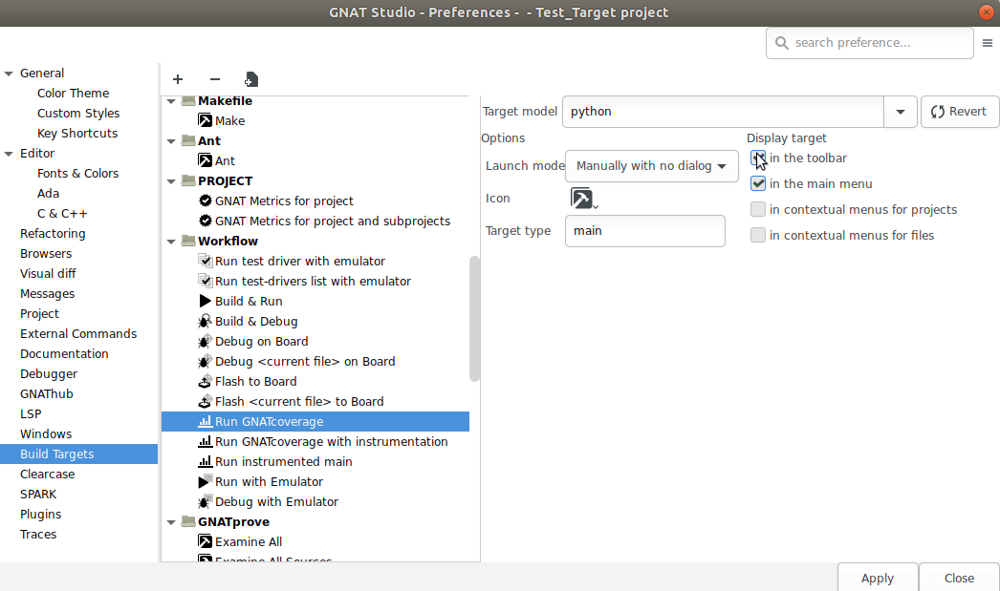

######################
Using |gcp| from |gps|
######################

GNATcoverage is integrated in |gps| so that it is possible to analyze code
coverage without leaving your favorite editor.

Basic usage
===========

As a first step, indicate which coverage criterion GNATcoverage should use.
The default is stmt.
For this, go to the project properties (:menuselection:`Edit -->
Project Properties...`).

.. image:: gps_screenshots/3-cov-level.png

In the GNATcov entry, you can change the coverage level passed to |gcv| commands
in the corresponding *Coverage level* combo boxes. Change both to
``stmt+decision``.

This is all for the setup part. Then you just need to click on the
*Run GNATcoverage* toolbar button as shown in the following screenshot.

.. image:: gps_screenshots/4-run.png

This button uses GNATcoverage instrumentation capabilities by default. It will
perform each needed step: build the GNATcoverage runtime, instrument your
project, build the instrumented version of it, run the instrumented program, and
display a *Coverage Report* view which displays the ratio of source lines that
are covered.

Note that each step can be performed individually by clicking on their
respective menu items under the
:menuselection:`Analyze --> Coverage --> GNATcoverage Source Traces`.

Also Note that you can select a prebuilt gnatcov runtime under the same menu.
This will skip the "build the gnatcov runtime" step, and will be especially
useful if you bring modifications to this runtime. By default, GNATstudio will
rebuild the runtime that is shipped with GNATcoverage and reinstall it in a
temporary directory every time.

.. image:: gps_screenshots/5-report.png

In order to read the detail of which line is covered and which line is not,
double-click on the file you want to inspect. This will open an editor on the
file with annotations that represent the coverage state:

* red annotations for uncovered ones;
* orange annotations for partially covered ones;
* green annotations for covered ones.

.. image:: gps_screenshots/6-detailed-report.png

Note that the Locations view reports all non-covered lines. It makes navigation
easy as you only have to click on a diagnostic to go to the corresponding line.

Binary traces usage
===================

Starting from GNATcoverage version 22.0, binary traces (using gnatcov run) are
no longer supported in native profiles. This mode is still supported for cross
configurations so the same steps performed above for source traces can be done
for binary traces IF you are in a supported configuration (otherwise, the menu
items won't show up).

Go to the menu
:menuselection:`Analyze --> Coverage --> GNATcoverage Binary Traces`.
to perform each step individually, or use the ``Run All Actions`` item.

You can also replace the toolbar button (dedicated to the instrumentation-based
scheme) with an alike button, but for binary traces. Go to GNATstudio
Preferences in :menuselection:`Edit --> Preferences`.

Then, go to the ``Build Targets`` section, and find the ``Run GNATcoverage``
workflow: add it to the toolbar as shown below.

Remove from the toolbar the ``Run GNATcoverage with instrumentation`` in the
same fashion.

GNATtest scenario
=================

Using |gcp| |gtest|-based testsuite in |gps| comes naturally as the combination
of both. Open the project you want to test and then generate the unit test
setup for it. Using the menu: :menuselection:`Analyze --> GNATtest --> Generate
Unit Test Setup`.

Write your testcases, and when you are ready to run your testsuite, switch to
the ``gnatcov`` build mode, select the desired coverage criteria in the project
properties. Now, click on the *Run GNATcoverage* toolbar button.

Depending on your version of |gcp|, logs in the Messages view might include
warnings which mention the various helper projects generated and used by the
|gtest| setup, for instance AUnit. These should not influence coverage
analysis results for the units of your project.
