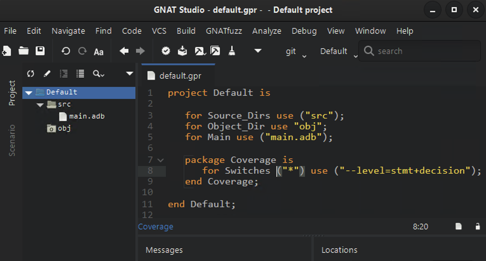

######################
Using |gcp| from |gps|
######################

GNATcoverage is integrated in |gps| so that it is possible to analyze code
coverage without leaving your favorite editor.

Basic scenario
==============

As a first step, indicate which coverage criterion GNATcoverage should use
through the :ref:`project file<switches_attr>`. If no coverage level is set
in the project file, gnatcov  will default to ``stmt``, and emit a warning
indicating that the coverage level is not set.
For this, go to the project properties (:menuselection:`Edit -->
Project Properties...`).

In the :menuselection:`Build --> Switches --> GNATcoverage` entry, you can
change the coverage level passed to |gcv| commands in the corresponding
*Coverage level* combo
box. Change it to ``stmt+decision``.

This is all for the setup part. Then you just need to click on the
*Run GNATcoverage* toolbar button as shown in the following screenshot.

.. image:: gps_screenshots/4-run.png

This button uses GNATcoverage instrumentation capabilities by default. It will
perform each needed step: build the GNATcoverage runtime, instrument your
project, build the instrumented version of it, run the instrumented program, and
display a *Coverage Report* view which displays the ratio of source lines that
are covered.

Note that each step can be performed individually by clicking on their
respective menu items under the
:menuselection:`Analyze --> Coverage --> GNATcoverage Source Traces`.

Also Note that you can select a prebuilt gnatcov runtime under the same menu.
This will skip the "build the gnatcov runtime" step, and will be especially
useful if you bring modifications to this runtime. By default, GNAT Studio will
rebuild the runtime that is shipped with GNATcoverage and reinstall it in a
temporary directory every time.

In order to read the detail of which line is covered and which line is not,
double-click on the file you want to inspect. This will open an editor on the
file with annotations that represent the coverage state:

* red annotations for uncovered ones;
* orange annotations for partially covered ones;
* green annotations for covered ones.

Note that the Locations view reports all non-covered lines. It makes navigation
easy as you only have to click on a diagnostic to go to the corresponding line.

Viewing a coverage report produced outside of GNAT Studio
=========================================================

If the workflow is not adapted to your process, GNAT Studio also supports
displaying a coverage report produced externally, by first loading the coverage
data using any of the actionable `Load Data` item under
:menuselection:`Analyze --> Coverage`.

GNAT Studio expects a coverage report under the xcov+ format, under the object
directory of the project (<prj_obj>), or under <prj_obj>/xcov+.

Then you can visualize the report by clicking on
:menuselection:`Analyze --> Coverage --> Show coverage report`.

Using GNATtest's coverage integration makefile
==============================================

When using individual test drivers, it is not possible to use the regular
GNATcoverage integration. This is true when GNATtest is called with
:cmd-option:`--separate-drivers` or :cmd-option:`--stub` (as it implies
:cmd-option:`--separate-drivers`), as described in :ref:`Individual Test
Drivers<Individual_Test_Drivers>`. In this case, the integration of
GNATcoverage is done through the use of the generated integration makefile. For
details on how to use this makefile, see :ref:`Integration with
GNATcoverage<Gnatcov_Integration>`.

Producing coverage reports through GNATtest's coverage integration makefile
generates the coverage reports under the test driver's object director by
default. However, these reports contain coverage information not for the test
harness project, but for the project being tested with gnattest.

If the harness project is opened in GNAT Studio, the coverage data should be
loaded using the actionable `Load Data for All Projects` item.

Visualization of the reports is then done as previously described.

GNATtest scenario
=================

Using |gcp| |gtest|-based testsuite in |gps| comes naturally as the combination
of both. Open the project you want to test and then generate the unit test
setup for it. Using the menu: :menuselection:`Analyze --> GNATtest --> Generate
Unit Test Setup`.

Write your testcases, and when you are ready to run your testsuite, switch to
the ``gnatcov`` build mode, select the desired coverage criteria in the project
properties. Now, click on the *Run GNATcoverage* toolbar button.

Depending on your version of |gcp|, logs in the Messages view might include
warnings which mention the various helper projects generated and used by the
|gtest| setup, for instance AUnit. These should not influence coverage
analysis results for the units of your project.
