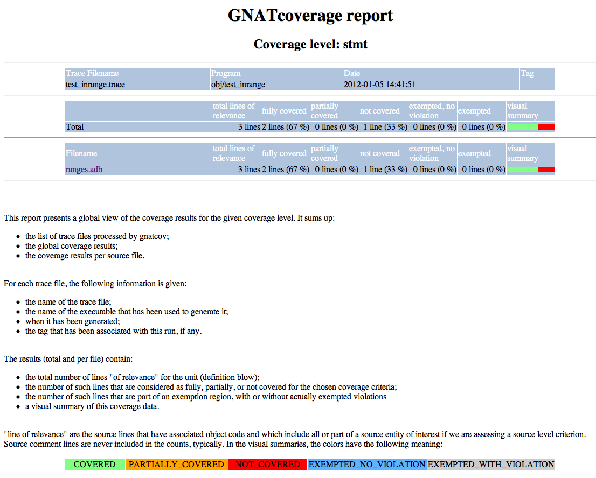
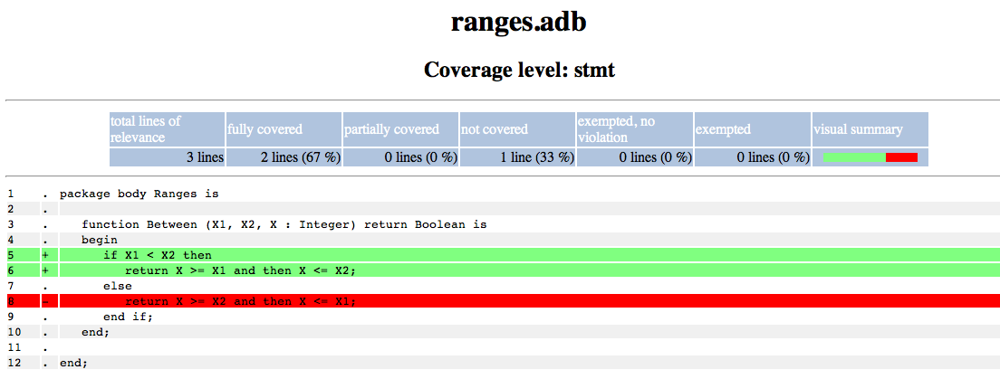

**********
Appendices
**********

.. _sample_sc_html_index:

Sample html index
=================

.. _sample_sc_html_unit:

Sample html annotated source
============================

.. _target_specific_notes:

Target specific points of note
==============================

The following list summarizes points of note for each target where some
aspects of the build/execution/analysis process depart from the general
instructions.

For **powerpc-vxworks6**:

- Need to compile with -gno-strict-dwarf for source coverage analysis;

- Need to add a --kernel argument on |gcvrun|;

- The provided kernel has to be augmented with a specific module
  for gnatcov purposes. Please refer to the |gem| documentation for this
  part of the process;

- Support for the ``kernel`` Ada RTS and Downloadable Kernel Modules only.

.. _known_limitations:

Known Limitations
=================

Incomplete statement coverage on lines with multiple statements
---------------------------------------------------------------

On lines with multiple statements, the tool may not be able to infer
accurate statement coverage results for each individual statement. The
tool emits explicit diagnostics in this case.

In :option:`=report` outputs (with :option:`--annotate=report`), this
translates as a statement coverage violation like::

 <sloc>: multiple statements on line, unable to establish full statement coverage

where <sloc> is a source-filename:line:column source location of the
problematic line.

In annotated sources kinds of outputs, this materializes as '!' note
indicating partial coverage on the affected lines, with the :option:`=report`
violation text quoted above available as part of the line extra-details
expanded on demand (:option:`=html+` and :option:`xcov+` output formats).
