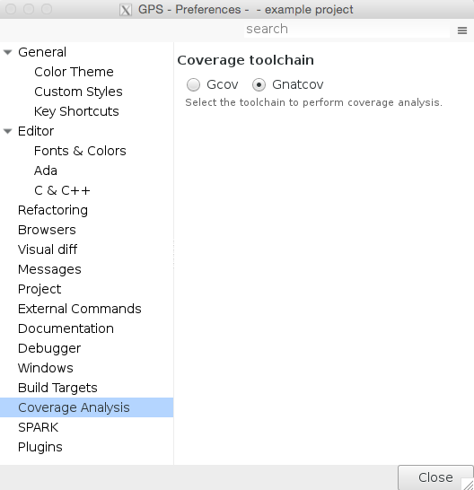
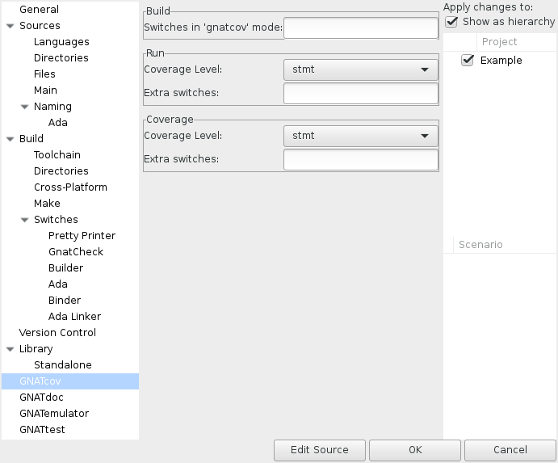
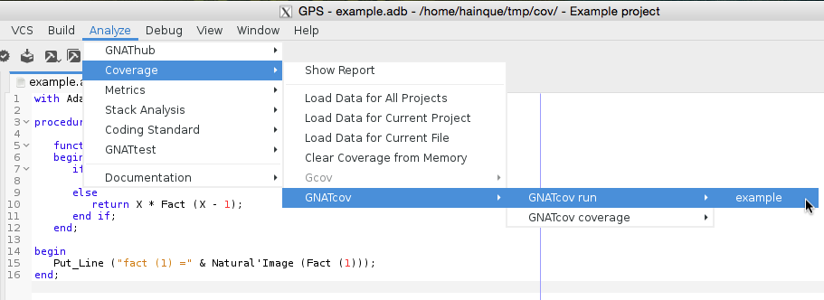
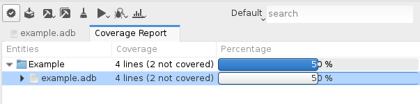
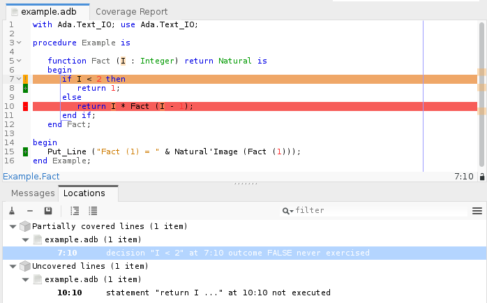

######################
Using |gcp| from |gps|
######################

GNATcoverage is integrated in |gps| so that it is possible to analyze code
coverage without leaving your favorite editor.

Basic usage
===========

Open the project that embeds the code you want to analyze in |gps|. The first
thing to do is to configure |gps| to use |gcp| for the coverage analysis: go to
the :menuselection:`Edit --> Preferences` menu. There, go to the ``Coverage
Analysis`` entry and select the ``Gnatcov`` toolchain.

This step is not tied to a particular project, so this is done once for all: it
will apply to all the other projects you work with in GPS.

The next step is to tell which coverage criterion GNATcoverage should use.
For this, go to the project properties (:menuselection:`Edit -->
Project Properties...`).

In the GNATcov entry, you can change the coverage level passed to both |gcvrun|
and |gcvcov| in the corresponding *Coverage level* combo boxes. Change both to
``stmt+decision``.

This is all for the setup part. Then you just need to click on the
*Run GNATcoverage* toolbar button as shown in the following screenshot.

This will build the selected executable with the appropriate compilation options
, execute the |gcvrun| and |gcvcov| steps at once, and display a
*Coverage Report* view which displays the ratio of source lines that are
covered.

You can also execute each of these steps invidividually by clicking on their
respective menu items under the
:menuselection:`Analyze --> Coverage` menu items.

In order to read the detail of which line is covered and which line is not,
double-click on the file you want to inspect. This will open an editor on the
file with annotations that represent the coverage state:

* red annotations for uncovered ones;
* orange annotations for partially covered ones;
* green annotations for covered ones.

Note that the Locations view reports all non-covered lines. It makes navigation
easy as you only have to click on a diagnostic to go to the corresponding line.

GNATtest scenario
=================

Using |gcp| |gtest|-based testsuite in |gps| comes naturally as the combination
of both. Open the project you want to test and then generate the unit test
setup for it. Using the menu: :menuselection:`Analyze --> GNATtest --> Generate
Unit Test Setup`.

Write your testcases, and when you are ready to run your testsuite, switch to
the ``gnatcov`` build mode, select the desired coverage criteria in the project
properties. Now, click on the *Run GNATcoverage* toolbar button.

Depending on your version of |gcp|, logs in the Messages view might include
warnings which mention the various helper projects generated and used by the
|gtest| setup, for instance AUnit. These should not influence coverage
analysis results for the units of your project.
