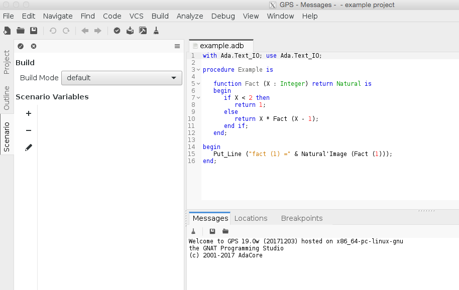
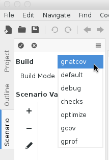
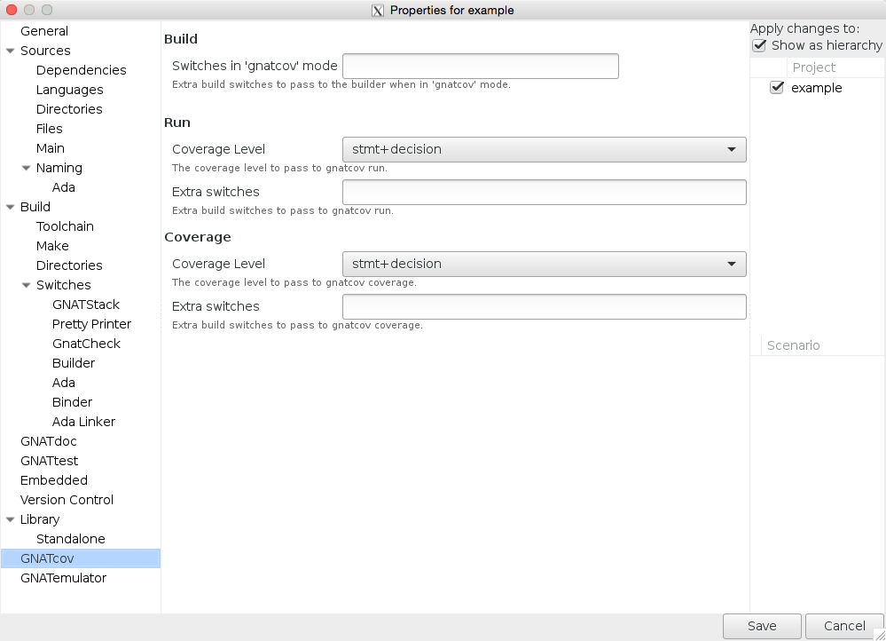
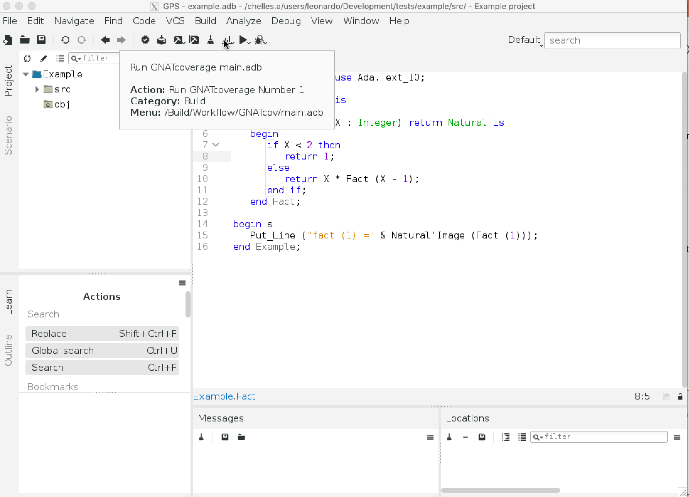
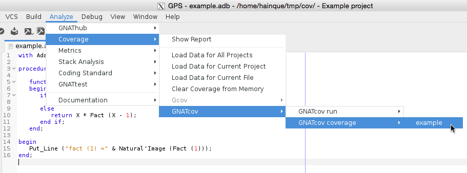
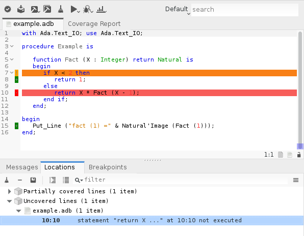

######################
Using |gcp| from |gps|
######################

GNATcoverage is integrated in |gps| so that it is possible to analyze code
coverage without leaving your favorite editor.

Basic usage
===========

Open the project that embeds the code you want to analyze in |gps|. The first
thing to do is to configure |gps| to use |gcp| for the coverage analysis: go to
the :menuselection:`Edit --> Preferences` menu. There, go to the ``Coverage
Analysis`` entry and select the ``Gnatcov`` toolchain.

This step is not tied to a particular project, so this is done once for all: it
will apply to all the other projects you work with in GPS.

The next step is to tell |gps| to build your project for |gcp|, with the
appropriate compilation options. In order to do this, open the Scenario view
(:menuselection:`Tools --> Views --> Scenario`).

Then, change the Build mode from ``default`` to ``gnatcov``.

GNATcoverage supports multiple coverage criteria. In order to select which one
to use, go to the project properties (:menuselection:`Project -->
Properties...`).

In the GNATcov entry, you can change the coverage level passed to both |gcvrun|
and |gcvcov| in the corresponding *Coverage level* combo boxes. Change both to
``stmt+decision``.

This is all for the setup part. The |gcvrun| and |gcvcov| steps are available
for each main unit in the :menuselection:`Tools --> GNATcov` menu. First build
your program (:menuselection:`Build --> Project --> Build All`), then execute
the ``GNATcov run`` and the ``GNATcov coverage`` commands.

Each entry in the :menuselection:`Tools --> GNATcov --> GNATcov coverage`
submenu opens a Coverage Report tab which displays the ratio of source lines
that are covered.

In order to read the detail of which line is covered and which line is not,
double-click on the file you want to inspect. This will open an editor on the
file with annotations that represent the coverage state:

* red annotations for uncovered ones;
* orange annotations for partially covered ones;
* green annotations for covered ones.

Note that the Locations view reports all non-covered lines. It makes navigation
easy as you only have to click on a diagnostic to go to the corresponding line.

GNATtest scenario
=================

Using |gcp| |gtest|-based testsuite in |gps| comes naturally as the combination
of both. Open the project you want to test and then generate the unit test
setup for it. Using the menu: :menuselection:`Tools --> GNATtest --> Generate
Unit Test Setup`.

Write your testcases, and when you are ready to run your testsuite, switch to
the ``gnatcov`` build mode, select the desired coverage criteria in the project
properties. Now, build your program (:menuselection:`Build --> Project` menu),
run it and launch a coverage analysis for it (:menuselection:`Tools -->
GNATcov`).

Logs from |gcp| (in the Messages view) will include warnings which mention the
various helper projects generated and used by the |gtest| setup, for instance
AUnit. While this is not a problem for the coverage analysis, we plan to fix
this so that this report includes only the project you are working on.
