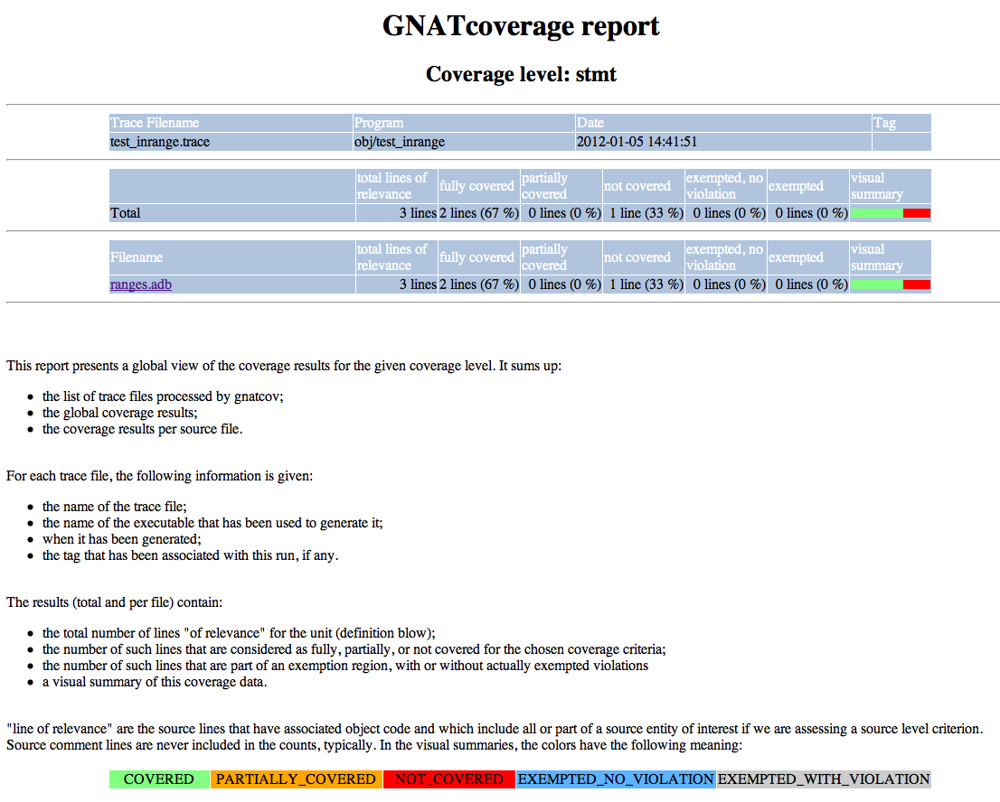

**********
Appendices
**********

.. _sample_sc_html_index:

Sample html index, Source Coverage
==================================

.. _sample_sc_html_unit:

Sample html annotated source, Source Coverage
=============================================

.. image:: sample_sc_html_unit.png

Trace Format Definition
=======================

This information is best located and maintained in the source comments, where
it naturally gets updated as the project evolves. Below is a verbatim
inclusion of the relevant Ada specification:

.. include: ../qemu_traces.ads
  

Source Coverage Obligations Definition
======================================

Below is a verbatim inclusion of the relevant Ada specification:

::

  @verbatiminclude gnat/scos.ads
  

XML output specifications
=========================

Below is a verbatim inclusion of the relevant Ada specification:

::

  @verbatiminclude annotations-xml.ads
  

